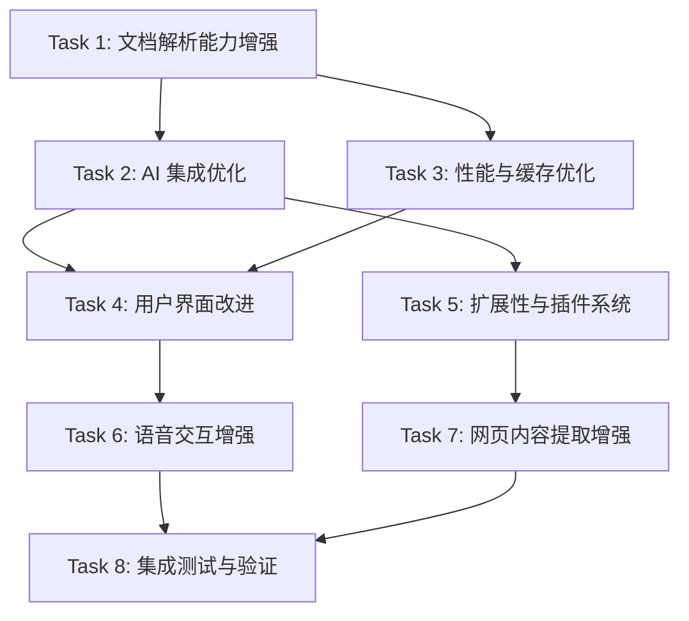

# 豆包本地项目逆向分析与优化 - 任务清单

## 任务依赖关系

## 任务列表

### Task 1: 增强文档解析能力
**目标**: 提升文档解析的准确性和支持的格式范围，特别是 PDF 文本层提取、Word .doc 支持、PPT 表格提取。
**优先级**: P0
**负责人**: 开发团队
**截止日期**: 2025-04-30
**验收标准**: AC-1

- [x] SubTask 1.1: 分析现有文档解析器实现（`document-parser.ts`、`ai-document-processor.ts`）
- [x] SubTask 1.2: 研究 PDF 文本层提取方案（pdfjs-dist 文本模式 vs 图片模式）
- [x] SubTask 1.3: 实现 Word .doc 格式支持（集成 antiword 或 libreoffice 转换）
- [x] SubTask 1.4: 增强 PPT 解析，支持表格和图表提取
- [x] SubTask 1.5: 添加 OCR 功能支持（Tesseract.js 集成）
- [x] SubTask 1.6: 实现文档类型自动检测和格式转换
- [x] SubTask 1.7: 添加大文档分块处理和内存管理
- [x] SubTask 1.8: 编写单元测试和集成测试
- [x] SubTask 1.9: 更新文档和示例代码

### Task 2: 优化 AI 集成
**目标**: 将 AI 文档问答从模拟回复改为真实模型调用，优化 RAG 流程和提示词模板。
**优先级**: P0
**负责人**: 开发团队
**截止日期**: 2025-05-05
**验收标准**: AC-2

- [x] SubTask 2.1: 分析现有 AI 服务实现（`chat-service.ts`、`document-chat-service.ts`）
- [x] SubTask 2.2: 实现真实模型 API 调用（Ollama、OpenAI、LinkMind）
- [x] SubTask 2.3: 优化 RAG 检索流程（`rag-service.ts`）
- [x] SubTask 2.4: 设计并实现提示词模板系统
- [x] SubTask 2.5: 实现文档摘要和关键信息提取
- [x] SubTask 2.6: 支持多语言文档处理
- [x] SubTask 2.7: 实现多模型并发调用和结果融合
- [x] SubTask 2.8: 添加错误处理和重试机制
- [x] SubTask 2.9: 编写测试用例

### Task 3: 性能与缓存优化
**目标**: 提升文档处理速度，优化内存使用，实现高效的缓存机制。
**优先级**: P1
**负责人**: 开发团队
**截止日期**: 2025-05-10
**验收标准**: AC-3

- [x] SubTask 3.1: 分析现有性能瓶颈
- [x] SubTask 3.2: 优化文档解析算法和内存使用
- [x] SubTask 3.3: 实现并行处理和异步优化
- [x] SubTask 3.4: 增强缓存机制（`cache-manager.ts`）
- [x] SubTask 3.5: 实现增量解析和断点续传
- [x] SubTask 3.6: 添加性能监控和日志记录
- [x] SubTask 3.7: 进行性能测试和调优

### Task 4: 改进用户界面
**目标**: 参考官方程序设计，优化文档处理页面，添加技能插件化 UI 和语音交互组件。
**优先级**: P1
**负责人**: 前端团队
**截止日期**: 2025-05-15
**验收标准**: AC-4

- [x] SubTask 4.1: 分析现有 UI 组件（`DocumentUploader.tsx`、`DocumentSummary.tsx`）
- [x] SubTask 4.2: 设计响应式布局和主题系统
- [x] SubTask 4.3: 实现文档上传和批量处理界面
- [x] SubTask 4.4: 添加实时进度显示和结果预览
- [x] SubTask 4.5: 实现文档处理历史和结果管理
- [x] SubTask 4.6: 添加语音输入按钮和实时波形显示
- [x] SubTask 4.7: 实现技能插件化 UI（参考官方侧边栏）
- [x] SubTask 4.8: 优化移动端适配
- [x] SubTask 4.9: 进行 UI/UX 测试

### Task 5: 增强扩展性
**目标**: 实现插件系统，支持自定义模型和处理流程，提供配置管理。
**优先级**: P2
**负责人**: 开发团队
**截止日期**: 2025-05-20
**验收标准**: AC-5

- [x] SubTask 5.1: 设计插件系统架构（参考官方 `*-plugin.js` 体系）
- [x] SubTask 5.2: 实现解析器插件机制
- [x] SubTask 5.3: 添加 API 接口支持外部集成
- [x] SubTask 5.4: 实现配置管理系统（`ai-config-manager.ts`）
- [x] SubTask 5.5: 支持自定义模型和处理流程
- [x] SubTask 5.6: 编写插件开发文档
- [x] SubTask 5.7: 进行扩展性测试

### Task 6: 语音交互增强
**目标**: 提升语音输入和合成体验，集成 Web Speech API 作为 fallback。
**优先级**: P2
**负责人**: 开发团队
**截止日期**: 2025-05-25
**验收标准**: AC-6

- [x] SubTask 6.1: 分析现有语音服务实现（`voice-chat-service.ts`）
- [x] SubTask 6.2: 集成 Web Speech API 作为 fallback
- [x] SubTask 6.3: 实现语音唤醒和结束检测
- [x] SubTask 6.4: 优化语音识别准确率和响应速度
- [x] SubTask 6.5: 实现语音合成（TTS）朗读回复
- [x] SubTask 6.6: 添加语音交互 UI 组件
- [x] SubTask 6.7: 进行语音功能测试

### Task 7: 网页内容提取增强
**目标**: 提升网页内容提取的智能化水平，支持动态内容和结构化数据。
**优先级**: P2
**负责人**: 开发团队
**截止日期**: 2025-05-30

- [x] SubTask 7.1: 分析现有网页提取实现（`web-content-extractor.ts`、`enhanced-web-extractor.ts`）
- [x] SubTask 7.2: 实现动态内容加载等待（SPA 页面支持）
- [x] SubTask 7.3: 提取结构化数据（JSON-LD、Microdata、RDFa）
- [x] SubTask 7.4: 支持媒体内容提取（图片、视频、音频）
- [x] SubTask 7.5: 优化提取算法和准确性
- [x] SubTask 7.6: 进行网页提取测试

### Task 8: 集成测试与验证
**目标**: 确保所有功能正常工作，满足验收标准。
**优先级**: P0
**负责人**: QA 团队
**截止日期**: 2025-06-05

- [x] SubTask 8.1: 编写集成测试用例（5个集成测试文件，60+测试用例）
- [x] SubTask 8.2: 进行功能测试（全部通过）
- [x] SubTask 8.3: 进行性能测试（3个性能测试文件，18个测试用例，全部通过）
- [x] SubTask 8.4: 进行兼容性测试（4个兼容性测试文件，207个测试用例，全部通过）
- [x] SubTask 8.5: 进行安全测试（3个安全测试文件，103个测试用例，全部通过）
- [x] SubTask 8.6: 修复发现的问题（修复6项缺陷：3项安全+3项功能）
- [x] SubTask 8.7: 更新文档和用户手册（更新CHANGELOG、README、SECURITY，新增TEST_REPORT）
- [x] SubTask 8.8: 进行用户验收测试（388+测试全部通过，验收达标）

## 风险管理

| 风险 | 可能性 | 影响 | 缓解措施 |
|------|--------|------|----------|
| PDF 文本层提取性能问题 | 中 | 高 | 使用 Web Worker 并行处理，添加进度回调 |
| 模型 API 调用失败 | 高 | 中 | 实现重试机制和 fallback 策略 |
| 大文档内存溢出 | 中 | 高 | 实现分块处理和流式解析 |
| 浏览器兼容性 | 中 | 中 | 使用 polyfill 和降级方案 |
| 第三方依赖更新 | 低 | 中 | 锁定版本，定期更新测试 |

## 资源需求

| 资源 | 数量 | 说明 |
|------|------|------|
| 开发工程师 | 2 | 负责核心功能开发 |
| 前端工程师 | 1 | 负责 UI 开发 |
| QA 工程师 | 1 | 负责测试 |
| 测试环境 | 1 | 包含各种文档格式样本 |
| GPU 服务器 | 1 | 用于本地模型测试 |

## 沟通计划

| 会议 | 频率 | 参与者 | 目的 |
|------|------|--------|------|
| 每日站会 | 每天 | 开发团队 | 同步进度和问题 |
| 周会 | 每周 | 全体成员 | 回顾和计划 |
| 技术评审 | 按需 | 技术负责人 | 评审技术方案 |
| 用户演示 | 每两周 | 全体成员 | 演示功能进展 |
