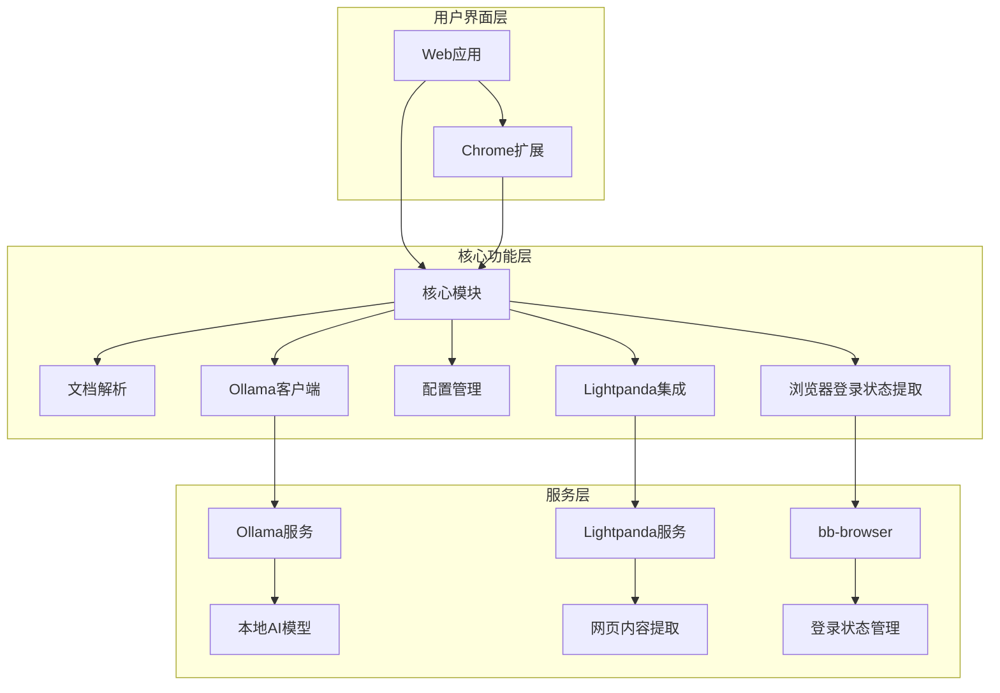

# 豆包AI助手技术文档

## 1. 项目架构

### 1.1 整体架构

豆包AI助手采用Monorepo架构，使用Turborepo进行管理，包含以下核心模块：

- **@doubao/core**：核心功能模块，包含文档解析、Ollama客户端、配置管理等
- **@doubao/web**：Web应用模块，基于Next.js 14开发
- **@doubao/extension**：Chrome扩展模块，支持浏览器集成

### 1.2 模块关系



## 2. 核心模块实现

### 2.1 核心模块（@doubao/core）

#### 2.1.1 文档解析

文档解析模块支持多种文件格式的解析，包括PDF、Word、Excel、PowerPoint、图片等。

**主要功能：**
- PDF解析：使用pdfjs-dist库解析PDF文件
- Word解析：使用mammoth库解析Word文档
- Excel解析：使用xlsx库解析Excel文件
- PowerPoint解析：使用pptx-parser库解析PPT文件
- 图片OCR：使用Tesseract.js库进行文字识别

**代码结构：**
```typescript
// 文档解析核心接口
export interface DocumentParser {
  parse(file: File | Buffer): Promise<DocumentContent>;
}

// PDF解析器实现
export class PDFParser implements DocumentParser {
  async parse(file: File | Buffer): Promise<DocumentContent> {
    // 实现PDF解析逻辑
  }
}

// Word解析器实现
export class WordParser implements DocumentParser {
  async parse(file: File | Buffer): Promise<DocumentContent> {
    // 实现Word解析逻辑
  }
}

// 解析器工厂
export class ParserFactory {
  static createParser(fileType: string): DocumentParser {
    // 根据文件类型创建对应的解析器
  }
}
```

#### 2.1.2 Ollama客户端

Ollama客户端模块负责与本地Ollama服务进行通信，支持聊天、模型管理等功能。

**主要功能：**
- 聊天接口：与AI模型进行对话
- 模型管理：列出、拉取、删除模型
- 参数配置：设置模型参数（Temperature、Top P等）

**代码结构：**
```typescript
// Ollama客户端接口
export interface OllamaClient {
  chat(messages: ChatMessage[], options?: ChatOptions): Promise<ChatResponse>;
  listModels(): Promise<Model[]>;
  pullModel(modelName: string): Promise<Model>;
  deleteModel(modelName: string): Promise<void>;
}

// Ollama客户端实现
export class DefaultOllamaClient implements OllamaClient {
  private baseUrl: string;
  
  constructor(baseUrl: string = 'http://localhost:11434') {
    this.baseUrl = baseUrl;
  }
  
  async chat(messages: ChatMessage[], options?: ChatOptions): Promise<ChatResponse> {
    // 实现聊天逻辑
  }
  
  async listModels(): Promise<Model[]> {
    // 实现列出模型逻辑
  }
  
  // 其他方法实现...
}
```

#### 2.1.3 配置管理

配置管理模块负责管理应用的各种配置选项，包括Ollama配置、代理配置、UI配置等。

**主要功能：**
- 配置存储：将配置保存到本地存储
- 配置加载：从本地存储加载配置
- 配置验证：验证配置的有效性

**代码结构：**
```typescript
// 配置接口
export interface AppConfig {
  ollama: {
    baseUrl: string;
    defaultModel: string;
    timeout: number;
    streaming: boolean;
  };
  proxy: {
    enabled: boolean;
    url: string;
  };
  ui: {
    theme: 'light' | 'dark' | 'system';
    language: string;
  };
  lightpanda: {
    mode: 'cli' | 'cdp' | 'docker';
    binaryPath: string;
    cdpAddress: string;
    containerName: string;
    timeoutMs: number;
  };
}

// 配置管理类
export class ConfigManager {
  private storageKey = 'doubao-config';
  
  async loadConfig(): Promise<AppConfig> {
    // 从本地存储加载配置
  }
  
  async saveConfig(config: AppConfig): Promise<void> {
    // 将配置保存到本地存储
  }
  
  validateConfig(config: AppConfig): boolean {
    // 验证配置的有效性
  }
}
```

### 2.2 Web应用模块（@doubao/web）

Web应用模块基于Next.js 14开发，提供用户界面和各种功能面板。

**主要功能：**
- 聊天界面：与AI模型进行对话
- 功能面板：提供各种AI工具
- 云盘集成：管理和使用云存储文件
- 主题切换：支持浅色、深色、跟随系统三种模式

**代码结构：**
```typescript
// 主要组件结构
- components/
  - ChatInput.tsx        // 聊天输入组件
  - ChatSidebar.tsx      // 侧边栏组件
  - MessageItem.tsx      // 消息项组件
  - MessageList.tsx      // 消息列表组件
  - CodeBlock.tsx        // 代码块组件
  - ThemeToggle.tsx      // 主题切换组件
  - panels/              // 功能面板
    - AICreationPanel.tsx
    - CloudStoragePanel.tsx
    - CodeReviewPanel.tsx
    - DataAnalysisPanel.tsx
    - TranslationPanel.tsx
    - WebContentExtractorPanel.tsx

// 自定义Hooks
- hooks/
  - useOllamaChat.ts     // Ollama聊天Hook
  - useKeyboardShortcuts.ts // 键盘快捷键Hook
  - useTheme.ts          // 主题Hook

// 状态管理
- store/
  - chatStore.ts         // 聊天状态
  - configStore.ts       // 配置状态
  - uiStore.ts           // UI状态
```

### 2.3 Chrome扩展模块（@doubao/extension）

Chrome扩展模块提供浏览器集成功能，支持网页内容提取和登录状态提取。

**主要功能：**
- 侧边栏：在浏览器侧边栏中访问豆包AI助手
- 上下文菜单：在网页中选中文本后提供操作选项
- 内容脚本：提取网页内容和登录状态

**代码结构：**
```typescript
// 扩展结构
- background/          // 后台脚本
  - background.ts      // 处理扩展后台逻辑
  - message-handler.ts // 处理消息通信

- content-script/      // 内容脚本
  - content-script.ts  // 注入到网页的脚本
  - content-extractor.ts // 网页内容提取
  - login-detector.ts  // 登录状态检测

- options/             // 选项页面
  - options.tsx        // 扩展选项

- side-panel/          // 侧边栏
  - side-panel.tsx     // 侧边栏UI
```

## 3. 特色功能实现

### 3.1 智能网页内容提取

智能网页内容提取功能使用多引擎策略，支持提取各种网页的内容。

**核心实现：**
- **多引擎策略**：自动选择最佳提取引擎（Lightpanda、Jina.ai、Readability）
- **智能内容识别**：基于多维度评分的内容提取算法
- **增强Markdown转换**：保留文档结构、代码高亮、表格转换

**代码结构：**
```typescript
// 网页内容提取接口
export interface WebContentExtractor {
  extract(url: string, options?: ExtractOptions): Promise<ExtractResult>;
  checkAvailability(): Promise<boolean>;
}

// Lightpanda引擎实现
export class LightpandaExtractor implements WebContentExtractor {
  async extract(url: string, options?: ExtractOptions): Promise<ExtractResult> {
    // 实现Lightpanda提取逻辑
  }
  
  async checkAvailability(): Promise<boolean> {
    // 检查Lightpanda是否可用
  }
}

// 多引擎管理器
export class ExtractorManager {
  private extractors: WebContentExtractor[];
  
  constructor() {
    this.extractors = [
      new LightpandaExtractor(),
      new JinaExtractor(),
      new ReadabilityExtractor()
    ];
  }
  
  async extract(url: string, options?: ExtractOptions): Promise<ExtractResult> {
    // 自动选择最佳提取引擎
  }
}
```

### 3.2 Lightpanda浏览器集成

Lightpanda浏览器集成提供高性能的网页内容提取能力。

**核心实现：**
- **多模式支持**：CLI、CDP服务器、Docker三种运行模式
- **JavaScript执行**：支持SPA页面和动态内容提取
- **智能降级**：失败时自动切换到备用引擎

**代码结构：**
```typescript
// Lightpanda客户端
export class LightpandaClient {
  private mode: 'cli' | 'cdp' | 'docker';
  private config: LightpandaConfig;
  
  constructor(config: LightpandaConfig) {
    this.mode = config.mode;
    this.config = config;
  }
  
  async startCdpServer(): Promise<void> {
    // 启动CDP服务器
  }
  
  async extract(url: string, options?: ExtractOptions): Promise<string> {
    // 根据模式执行提取
  }
  
  async checkStatus(): Promise<boolean> {
    // 检查Lightpanda状态
  }
}
```

### 3.3 浏览器登录状态提取

浏览器登录状态提取功能利用用户真实浏览器的登录状态来提取需要认证的网页内容。

**核心实现：**
- **标签页匹配**：根据URL模式查找已打开的标签页
- **登录状态检测**：检测页面中的登录状态指标
- **内容提取**：使用浏览器扩展的内容脚本提取内容

**代码结构：**
```typescript
// 登录状态提取器
export class LoginStateExtractor {
  async extract(url: string): Promise<ExtractResult> {
    // 查找匹配的标签页
    // 检测登录状态
    // 提取内容
  }
  
  async detectLoginState(tabId: number): Promise<LoginState> {
    // 检测标签页的登录状态
  }
  
  async getCookie(tabId: number, url: string): Promise<string> {
    // 获取标签页的Cookie
  }
}
```

## 4. API设计

### 4.1 网页内容提取API

**基本使用：**
```bash
# 自动选择引擎提取网页内容
curl "http://localhost:3000/api/read?url=https://example.com"

# 指定Lightpanda引擎
curl "http://localhost:3000/api/read?url=https://example.com&engine=lightpanda"

# 带滚动和等待（用于动态内容）
curl "http://localhost:3000/api/read?url=https://example.com&scrollToBottom=true&waitForSelector=.content"
```

**API参数：**
| 参数 | 类型 | 说明 | 默认值 |
|------|------|------|--------|
| `url` | string | 要提取的网页URL | 必填 |
| `engine` | string | 提取引擎（auto/lightpanda/jina/readability） | auto |
| `timeoutMs` | number | 超时时间（毫秒） | 30000 |
| `scrollToBottom` | boolean | 是否滚动到页面底部 | false |
| `waitForSelector` | string | 等待的CSS选择器 | - |

**响应格式：**
```json
{
  "success": true,
  "engine": "lightpanda",
  "mode": "cdp",
  "content": "提取的网页内容...",
  "title": "页面标题",
  "metadata": {
    "loadTime": 1234
  }
}
```

### 4.2 Ollama API

**聊天接口：**
```typescript
// 聊天请求
interface ChatRequest {
  model: string;
  messages: ChatMessage[];
  options?: {
    temperature: number;
    top_p: number;
    max_tokens: number;
    frequency_penalty: number;
    presence_penalty: number;
  };
  stream?: boolean;
}

// 聊天响应
interface ChatResponse {
  model: string;
  created_at: string;
  message: {
    role: string;
    content: string;
  };
  done: boolean;
}
```

## 5. 开发指南

### 5.1 环境设置

**前提条件：**
- Node.js 18+
- npm 9+
- Ollama（可选，用于本地AI模型）
- Docker（可选，用于Lightpanda）

**安装步骤：**
1. 克隆项目
   ```bash
   git clone <项目地址>
   cd doubao-refactored
   ```

2. 安装依赖
   ```bash
   npm install
   ```

3. 配置Ollama（可选）
   - 下载并安装Ollama：https://ollama.ai/
   - 启动Ollama服务
   - 在Web应用的配置面板中设置Ollama地址

4. 配置Lightpanda（可选）
   - **方式一：Docker（推荐）**
     ```bash
     # Windows
     .\scripts\start-lightpanda.bat
     
     # 或使用Docker Compose
     docker-compose up -d lightpanda
     ```
   - **方式二：本地安装**
     - 下载Lightpanda：https://github.com/lightpanda-io/browser/releases
     - 添加到系统PATH
     - 设置环境变量 `LIGHTPANDA_BIN=lightpanda`

### 5.2 运行开发模式

```bash
npm run dev
```

Web应用将在 http://localhost:3000 启动

### 5.3 构建生产版本

```bash
npm run build
```

### 5.4 打包Chrome扩展

```bash
npm run build:extension
```

扩展包将生成在 `packages/extension/dist` 目录

### 5.5 测试

```bash
# 运行单元测试
npm run test

# 运行端到端测试
npm run e2e
```

## 6. 部署指南

### 6.1 Web应用部署

**Vercel部署：**
1. 登录Vercel账号
2. 导入项目
3. 配置环境变量
4. 部署

**Netlify部署：**
1. 登录Netlify账号
2. 导入项目
3. 配置构建命令：`npm run build:web`
4. 配置发布目录：`packages/web/out`
5. 部署

### 6.2 Chrome扩展部署

**本地安装：**
1. 构建扩展：`npm run build:extension`
2. 在Chrome中打开 `chrome://extensions`
3. 开启开发者模式
4. 点击"加载已解压的扩展程序"
5. 选择 `packages/extension/dist` 目录

**Chrome Web Store发布：**
1. 构建扩展：`npm run build:extension`
2. 压缩 `packages/extension/dist` 目录为zip文件
3. 登录Chrome Web Store开发者控制台
4. 上传扩展包
5. 填写扩展信息
6. 提交审核

### 6.3 本地部署（Docker）

```bash
# 启动所有服务
docker-compose up -d

# 停止所有服务
docker-compose down
```

## 7. 故障排除

### 7.1 Lightpanda相关问题

**Lightpanda无法启动：**
- 检查Docker是否运行
- 检查端口9222是否被占用
- 查看容器日志：`docker logs lightpanda-browser`

**提取失败：**
- 检查URL是否可访问
- 增加超时时间：`timeoutMs=60000`
- 尝试不同的引擎：`engine=jina`

**动态内容提取不完整：**
- 启用滚动：`scrollToBottom=true`
- 等待特定元素：`waitForSelector=.content`
- 增加等待时间：`timeoutMs=60000`

### 7.2 浏览器登录状态提取问题

**扩展未安装：**
- 错误提示："浏览器扩展未安装"
- 解决方案：安装豆包AI助手浏览器扩展

**未找到标签页：**
- 错误提示："未找到匹配的标签页"
- 解决方案：先在浏览器中打开目标网站

**未登录：**
- 错误提示："未登录"
- 解决方案：在目标网站标签页中完成登录

**提取超时：**
- 错误提示："提取请求超时"
- 解决方案：检查网络连接，或稍后重试

### 7.3 Ollama相关问题

**Ollama服务未运行：**
- 错误提示："无法连接到Ollama服务"
- 解决方案：启动Ollama服务

**模型未下载：**
- 错误提示："模型不存在"
- 解决方案：在Ollama中下载相应模型

**请求超时：**
- 错误提示："请求超时"
- 解决方案：检查网络连接，或增加超时时间

## 8. 安全考虑

### 8.1 数据安全

- **本地存储**：敏感配置和数据存储在本地，不发送到服务器
- **加密传输**：使用HTTPS协议保护数据传输
- **权限控制**：浏览器扩展只请求必要的权限

### 8.2 隐私保护

- **本地AI**：使用本地Ollama模型，数据不离开用户设备
- **Cookie处理**：只在用户同意时访问和使用Cookie
- **数据收集**：可选的使用数据收集，默认关闭

### 8.3 安全最佳实践

- **输入验证**：验证所有用户输入，防止注入攻击
- **权限最小化**：只请求必要的权限
- **定期更新**：及时更新依赖库，修复安全漏洞
- **安全审计**：定期进行安全审计，确保代码安全

## 9. 总结

豆包AI助手是一个功能丰富、性能优越的本地AI助手解决方案，通过模块化架构和先进技术栈，提供了类似豆包AI助手的功能，同时保护用户隐私。项目的核心优势在于本地AI模型集成、高性能网页内容提取和丰富的工具集，为用户提供了一站式的AI助手体验。

通过本文档，开发人员可以了解项目的架构设计、核心功能实现和开发流程，从而更好地参与项目开发和扩展。未来，项目可以通过扩展浏览器支持、开发移动应用、增强多语言能力等方式进一步提升用户体验，成为更加全面和强大的AI助手工具。