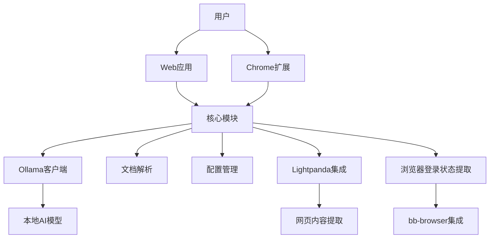

# 豆包AI助手重构项目分析报告

## 1. 项目概述

豆包AI助手重构项目是一个基于原生豆包程序逆向解析重构的本地项目，提供了类似豆包AI助手的功能，包括聊天、文档解析、代码审查、数据分析等多种AI工具。

### 1.1 项目定位

- **本地AI助手**：基于Ollama本地模型，保护用户隐私
- **多平台支持**：Web应用和Chrome扩展
- **功能丰富**：集成多种AI工具和实用功能
- **性能优化**：Lightpanda浏览器集成，提升网页内容提取性能

### 1.2 核心价值

- **隐私保护**：本地运行AI模型，数据不离开用户设备
- **功能丰富**：提供多种AI工具，满足不同场景需求
- **性能优越**：Lightpanda浏览器比Chrome快9倍，内存占用少16倍
- **扩展性强**：模块化架构，易于添加新功能

## 2. 技术架构

### 2.1 整体架构

项目采用Monorepo架构，使用Turborepo进行管理，包含以下核心模块：

- **@doubao/core**：核心功能模块，包含文档解析、Ollama客户端、配置管理等
- **@doubao/web**：Web应用模块，基于Next.js 14开发
- **@doubao/extension**：Chrome扩展模块，支持浏览器集成

### 2.2 技术栈

| 类别 | 技术 | 版本 | 用途 |
|------|------|------|------|
| 前端框架 | React | 18 | 构建用户界面 |
| 前端框架 | Next.js | 14 | Web应用框架 |
| 构建工具 | Turborepo | ^1.13.4 | 管理Monorepo |
| 样式 | Tailwind CSS | - | 响应式样式 |
| 状态管理 | Zustand | - | 轻量级状态管理 |
| 类型系统 | TypeScript | ^5.9.3 | 类型安全 |
| AI集成 | Ollama API | - | 本地AI模型服务 |
| 文档解析 | pdfjs-dist | ^5.6.205 | PDF解析 |
| 文档解析 | Mammoth.js | ^1.12.0 | Word文档解析 |
| 文档解析 | xlsx | ^0.18.5 | Excel文档解析 |
| 文档解析 | JSZip | ^3.10.1 | 压缩文件处理 |
| 文档解析 | Tesseract.js | ^7.0.0 | OCR文字识别 |
| 浏览器引擎 | Lightpanda | - | 高性能网页内容提取 |
| 容器化 | Docker & Docker Compose | - | 容器化部署 |

### 2.3 核心模块关系

## 3. 功能实现

### 3.1 核心功能

#### 3.1.1 聊天功能
- 与AI模型进行对话，支持流式响应
- 消息引用回复
- 历史会话分组管理
- 消息搜索
- 导出对话（Markdown、纯文本）

#### 3.1.2 文档解析
- 支持PDF、Word、Excel、PowerPoint、图片等多种格式
- 基于Tesseract.js的OCR文字识别
- 智能内容提取和结构化

#### 3.1.3 Ollama集成
- 支持本地Ollama模型服务
- 模型参数实时调节（Temperature、Top P、Max Tokens等）
- 可自定义Ollama服务地址和默认模型

#### 3.1.4 配置管理
- 代理设置
- UI设置（主题、语言）
- 隐私设置
- Lightpanda配置

### 3.2 Web应用功能

| 功能模块 | 描述 | 实现技术 |
|---------|------|---------|
| AI创作 | 生成文章、故事、诗歌等内容 | React + Ollama API |
| 云盘集成 | 管理和使用云存储文件，支持Seafile | React + Seafile API |
| 快捷工具 | 提供各种实用的AI工具 | React组件 |
| 截图提问 | 通过截图向AI提问 | Canvas API |
| 屏幕共享 | 共享屏幕内容进行分析 | WebRTC |
| PPT生成 | 根据内容生成PPT | React + 文档生成 |
| 写作助手 | 辅助写作，提供写作建议 | React + Ollama API |
| 语音聊天 | 通过语音与AI对话 | Web Speech API |
| 音频翻译 | 翻译音频内容 | Web Speech API + Ollama API |
| 逻辑模式 | 提供逻辑分析和推理 | Ollama API |
| 小程序 | 集成各种小应用 | React组件 |
| 书签管理 | 保存和管理书签 | 本地存储 |
| 文本选择器 | 选中文本后提供各种操作 | 浏览器API |
| 代码审查 | 分析代码质量、安全漏洞等 | Ollama API |
| 数据分析 | 分析各种格式的数据 | 数据处理库 |
| 翻译工具 | 翻译各种语言的文本 | Ollama API |
| 文本总结 | 总结文本内容 | Ollama API |
| 网页内容提取 | 智能提取网页内容 | Lightpanda + 多引擎策略 |

### 3.3 Chrome扩展功能

- 浏览器集成
- 侧边栏访问
- 上下文菜单
- 网页内容提取
- 登录状态提取

### 3.4 特色功能

#### 3.4.1 智能网页内容提取
- 基于多维度评分的智能提取算法
- 增强Markdown转换（保留文档结构、代码高亮、表格转换）
- 元数据提取（标题、作者、发布时间、站点信息）
- 可视化面板（三栏式结果展示）

#### 3.4.2 Lightpanda浏览器集成
- 多模式支持：CLI、CDP服务器、Docker
- 高性能提取：比Chrome快9倍，内存占用少16倍
- JavaScript执行：支持SPA页面和动态内容提取
- 多引擎策略：Lightpanda、Jina.ai、Readability自动选择

#### 3.4.3 浏览器登录状态提取
- 利用真实浏览器登录状态提取内容
- 登录状态检测和智能指示器
- 一键提取需要登录的页面
- 重试机制提高成功率

## 4. 技术优势

### 4.1 架构优势
- **模块化设计**：清晰的职责分离，易于维护和扩展
- **Monorepo管理**：使用Turborepo提高开发效率
- **类型安全**：全面使用TypeScript，减少运行时错误

### 4.2 性能优势
- **Lightpanda集成**：大幅提升网页内容提取性能
- **流式响应**：提供流畅的聊天体验
- **缓存机制**：减少重复计算和网络请求

### 4.3 功能优势
- **丰富的工具集**：满足多种AI应用场景
- **本地AI**：保护隐私，无需网络连接
- **多平台支持**：Web应用和Chrome扩展
- **智能内容提取**：支持复杂网页和需要登录的页面

## 5. 改进空间

### 5.1 技术改进
- **扩展支持**：增加对Firefox、Edge等其他浏览器的支持
- **移动应用**：开发移动版本，提供跨平台体验
- **性能优化**：进一步优化大型文档解析和处理速度

### 5.2 功能改进
- **多语言支持**：增强多语言处理能力
- **插件系统**：开发插件系统，支持第三方扩展
- **协作功能**：增加多用户协作功能

### 5.3 安全改进
- **安全审计**：定期进行安全审计，确保数据安全
- **隐私保护**：进一步加强隐私保护措施

## 6. 部署与使用

### 6.1 部署方式
- **Web应用**：可部署到Vercel、Netlify等平台
- **Chrome扩展**：可打包后上传到Chrome扩展商店
- **本地部署**：使用Docker Compose快速部署

### 6.2 系统要求
- Node.js 18+
- npm 9+
- Ollama（可选，用于本地AI模型）
- Docker（可选，用于Lightpanda）

### 6.3 安装步骤
1. 克隆项目
2. 安装依赖
3. 配置Ollama（可选）
4. 配置Lightpanda（可选）
5. 运行开发模式或构建生产版本

## 7. 总结

豆包AI助手重构项目是一个功能丰富、性能优越的本地AI助手解决方案，通过模块化架构和先进技术栈，提供了类似豆包AI助手的功能，同时保护用户隐私。项目的核心优势在于本地AI模型集成、高性能网页内容提取和丰富的工具集，为用户提供了一站式的AI助手体验。

未来，项目可以通过扩展浏览器支持、开发移动应用、增强多语言能力等方式进一步提升用户体验，成为更加全面和强大的AI助手工具。